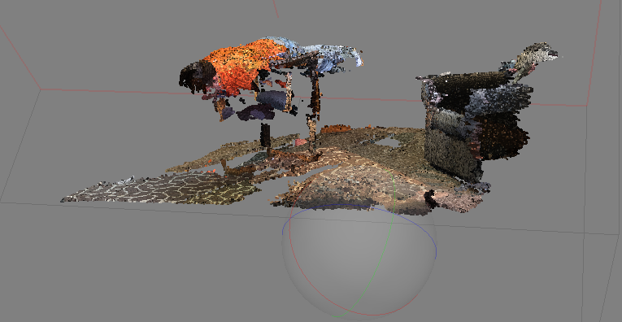
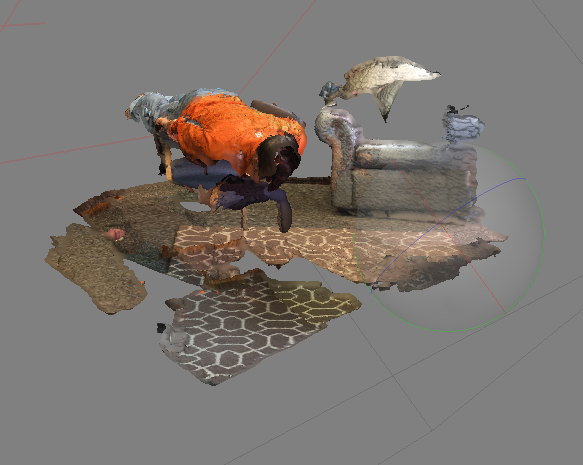

# Planking
## _By Max Boath_

### https://maxxyb33.github.io/3d-max/

Created with Agisoft Photoscan Professional and Potree.

76 individual images were taken of the scene using an iPhone 6.  They were then put through Photoscan to tie the images together using tie-points, and a sparse and dense point cloud could be created.  The dense point cloud was exported as a .las file, then put through  PotreeConverter.exe from [Potree](https://github.com/potree/potree) with the following command in the command prompt: 
`PotreeConverter.exe C:\Users\boathm\Desktop\PotreeConverter_1.6_windows_x64\max.las -o C:\Users\boathm\Desktop\PotreeConverter_1.6_windows_x64 -p index --overwrite --output-format LAS`

A screenshot of the dense point cloud can be viewed here:

...And a constructed mesh model:

Created 5/29/2018 for Geog572.  Photos taken by RF in Snell Hall, OSU.  Shoutout to Jared Ritchey for the assistance.
